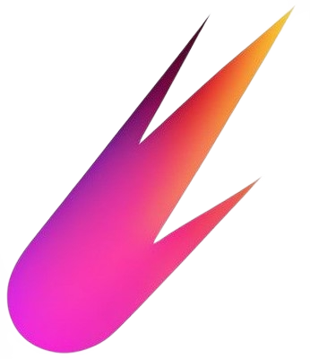
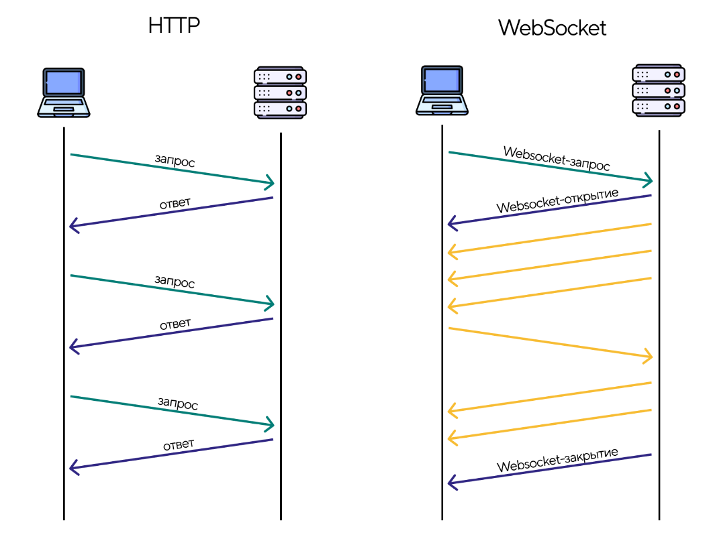
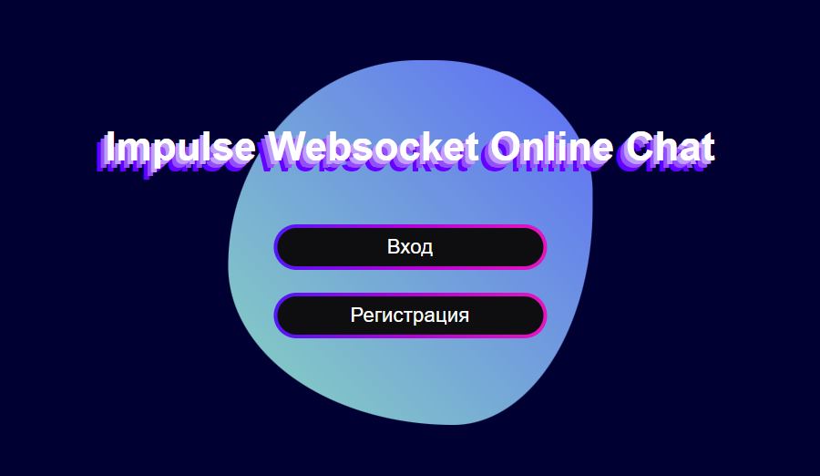
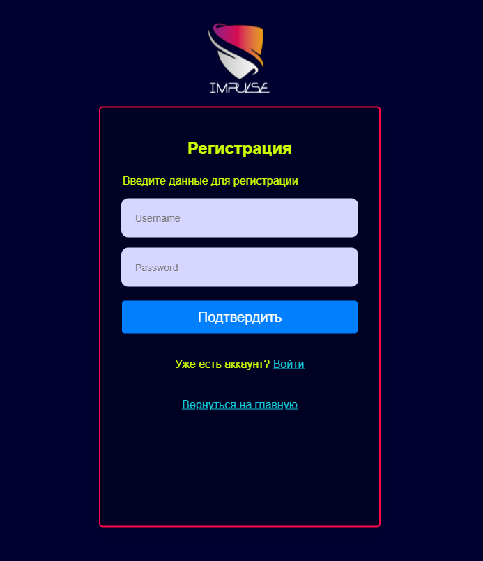
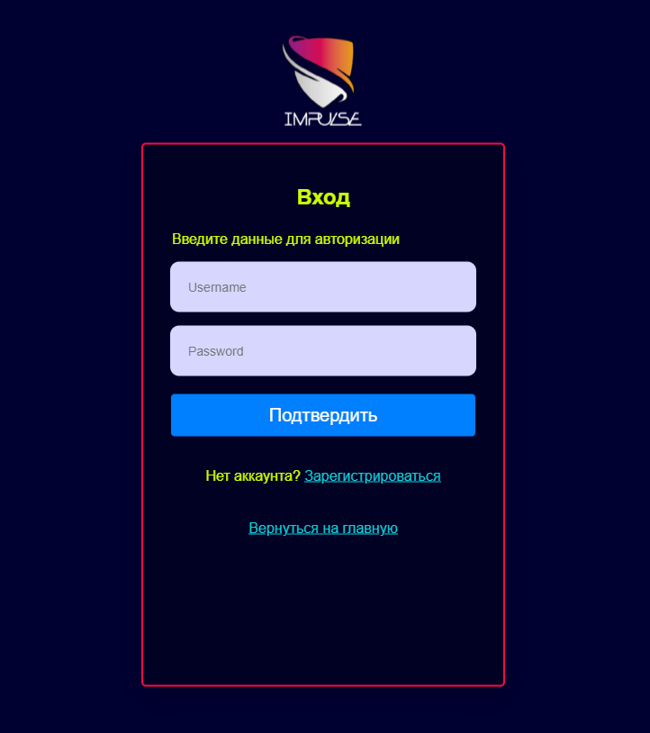
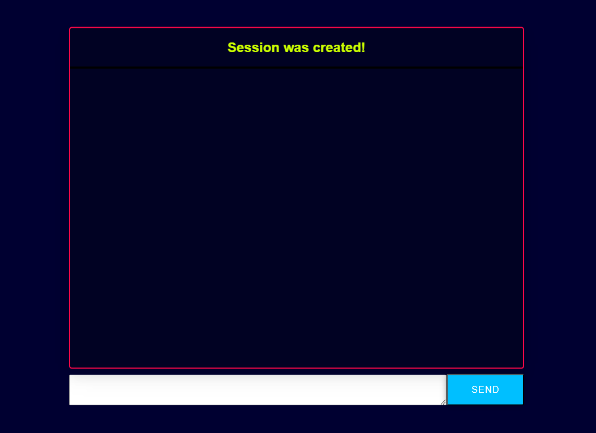

    

<h1 align="center">
Impulse - Online Chat
</h1>

&emsp;&emsp;Данный репозиторий включает в себя реализацию кейса по разработке онлайн чата с возможностью входа и регистрации с хакатона от СНО КПК (16.10.2023 - 19.10.2023).

<h2 align="center">
    Онлайн чат в режиме реального времени с возможностью входа и регистрации
</h2>

<h3 align="center">
    Требования к разрабатываемому программному обеспечению
</h3>

&emsp;&emsp;&emsp;&emsp;:small_blue_diamond: Для работы в режиме реального времени рекомендуется использовать технологию WebSocket;

&emsp;&emsp;&emsp;&emsp;:small_blue_diamond: Нельзя пользоваться фреймворками на стороне Backend;

&emsp;&emsp;&emsp;&emsp;:small_blue_diamond: Возможно использование Vue/React/Next на стороне Frontend;

&emsp;&emsp;&emsp;&emsp;:small_blue_diamond: Для реализации Backend рекомендуется использовать следующие языки: PHP, Python, JS, Go;

&emsp;&emsp;&emsp;&emsp;:small_blue_diamond: Чат должен иметь хотя бы минимальную стилистику;

&emsp;&emsp;&emsp;&emsp;:small_blue_diamond: Для сохранения информации рекомендуется использовать MySQL, SQLite или NoSQL (MongoDB).

<h3 align="center">
    Дополнительные требования
</h3>

&emsp;&emsp;&emsp;&emsp;:small_blue_diamond: Реализовать сквозное шифрование;

&emsp;&emsp;&emsp;&emsp;:small_blue_diamond: Реализовать профиль пользователя, статус;

&emsp;&emsp;&emsp;&emsp;:small_blue_diamond: Реализовать редактирование и удаление сообщений.

<h3 align="center">
    Описание решения
</h3>

&emsp;&emsp;Основой нашего решения служит клиент-серверная архитектура, основанная на технологии WebSocket

    

<h3 align="center">
    Выбранный стек
</h3>

&emsp;&emsp;&emsp;&emsp;:triangular_flag_on_post: Backend - Python (asyncio, asyncpg (работа с БД), aiohttp (надстройка для работы с HTTP внутри asyncio), websockets);

&emsp;&emsp;&emsp;&emsp;:triangular_flag_on_post: Frontend - HTML5/CSS3;

&emsp;&emsp;&emsp;&emsp;:triangular_flag_on_post: Database - PostgreSQL;

&emsp;&emsp;&emsp;&emsp;:triangular_flag_on_post: Containerization - Docker;

<h3 align="center">
    Демо в картинках
</h3>

    

    

    

    

<h3 align="center">
    Участники проекта
</h3>

&emsp;&emsp;&emsp;&emsp;:octocat: Иорин Давид Андреевич - Team Leader, Backend Developer;

&emsp;&emsp;&emsp;&emsp;:octocat: Богданов Данила Андреевич - DevOps, Software Architect;

&emsp;&emsp;&emsp;&emsp;:octocat: Беляев Иван Дмитриевич - Frontend Developer;
